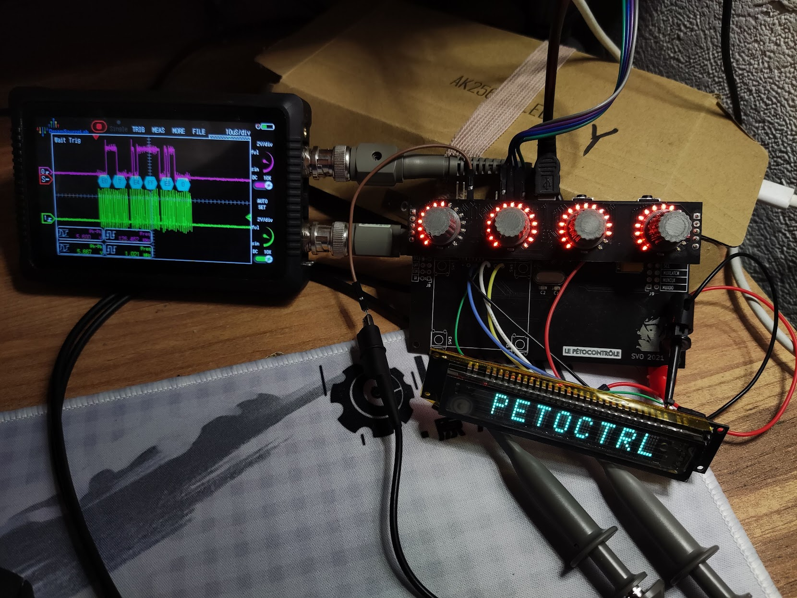
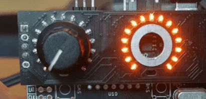
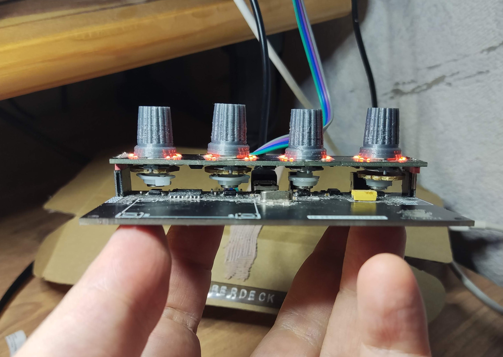

# Pétocontrôle

This is a MIDI control surface that sends CC messages when you turn the knobs. The main features are:

 * magnetic encoders (AS5600) with real potentiometer mechanics for ultra-smooth potentiometer-like feel
 * beautiful 0402 orange LEDs that show knob positions
 * Futaba 8-MD-06INKM VFD display

I wanted smooth feel encoders that work like proper potentiometers. These days everything is implemented using notchy encoders and although smooth input encoders do exist, they are somewhat uncommon.

The design consists of two boards, the bottom one has MCU and the sensors, the top "mezzanine" board has the shift registers for the LEDs and holes for the knob shafts. 
The knobs are mechanisms ripped out from cheap potentiometers, they have little magnets glued into their bottom ends. Several boards can in theory attach to one another to form long strips of knobs.

## Design files
 * [Schematics and PCB (KiCanvas)](https://kicanvas.org/?github=https://github.com/svofski/lepetomane-control/tree/master/kicad)
 
